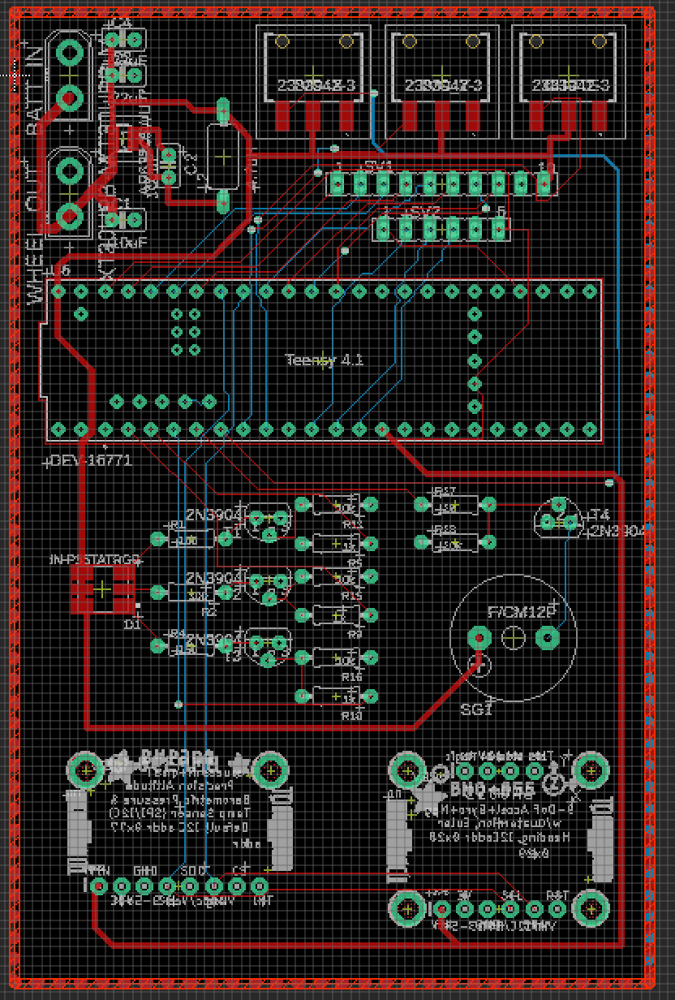
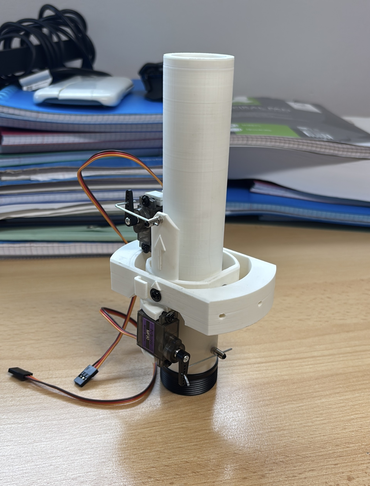
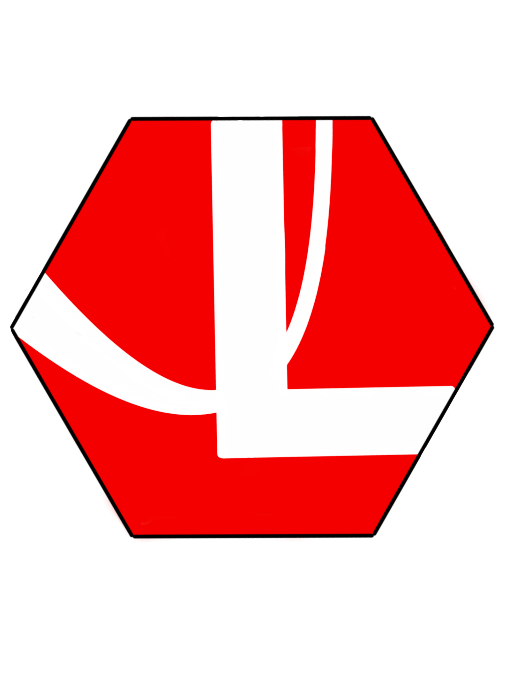

Rocket
======

Welcome to our latest Project of 2025: a rocket guidance system. 

This project took around half a year to build, the other part of the year was spent documenting it. It was originally aimed to improve larger project management under time pressure and university schedule. We wanted to do this project a few years ago already, but somehow ended up with other side quests to fulfill, so this can be seen as our last highschool project, marking a waypoint for bigger, badder and more complex projects. I almost forgot that this project was also supposed to "cure problems related to boredom" and I want to point out that it definitely managed to fill quite some hours...maybe a few too many? Nah...this was worth it. 

This repo will only serve as a project overview and memory. This encompasses the code, the prints, the project paper and most importantly: some pictures 

Table of Content
================

<!--ts-->
- [Visual Designs](#Visual-Designs)
- [Board Computer](#Board-Computer)
- [Parachute Deployment](#Parachute-Deployment)
- [Thrust Vector Control System](#TVC-System)
- [About us](#About-us)
<!--te-->

Visual Designs
==============

Board Computer
==============

Parachute Deployment
====================

TVC System
==========

About us
========

