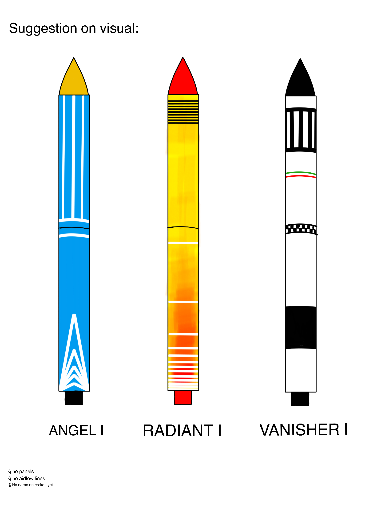

# Rocket

This a half-year project with the goal of making a thrust-vector-conctrolled rocket. It aims to improve larger project management under time pressure and university schedule, Fusion360 skills and finish the list of what we wanted to do by the end of highschool(Yes we are late). Not to forget, this should resolve any issues related to boredom.

## Table of Contents
- [Visual Design](#Visual Designs)
- [Board Computer](#Board Computer)
- [Parachute Deployment](#Parachute Deployment)
- [Thrust Vector Control System](#TVC System)
- [About us](#About us)

##Visual Designs

##Board Computer

##Parachute Deployment

##TVC System

##About us

